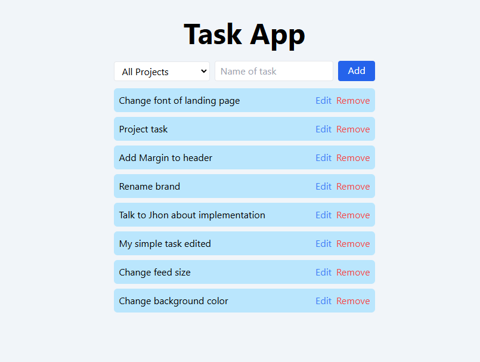

# Task manager

This is my solution to the challenge of the task manager in which have used the latest best practices related to PHP and Laravel.

**Video tour:** [link](https://jam.dev/c/d1037b6d-5651-4a61-bbd4-67c34c354acc)



## Important

You must have Docker to run this application and PHP >= 8.2.

## **Installation**

```bash
git clone https://github.com/NahuCF/task-app.git
cd task-app
composer install
npm install
cp .env.example .env
php artisan key:generate
```

## How to run

```bash
./vendor/bin/sail up
./vendor/bin/sail artisan migrate --seed
./vendor/bin/sail npm run dev
```

Access app: http://localhost:8080
